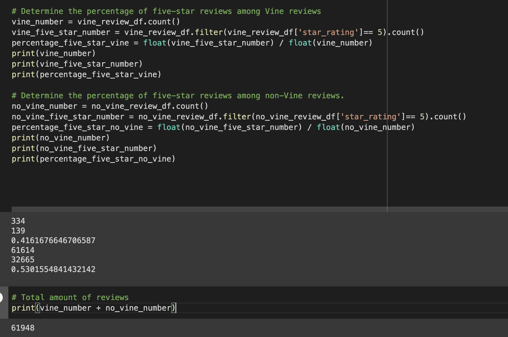

# Amazon_Vine_Analysis by Ben Altshuler

## Overview
Our team was tasked with analyzing Amazon reviews written by members of the paid Amazon Vine program. Vine (not to be confused with the video-based social media venture that arguably inspired TikTok) is a service that allows manufacturers and publishers to receive reviews for their products. Companies pay a small fee to Amazon and provide products to Amazon Vine members, who are then required to publish a review.

We chose a product category to analyze reviews from Vine and non-Vine sources in an effort to identify potential bias in the star ratings. 

The team used pySpark to create dataframes of the review information. Then, we created an RDS database and connected the instance to pgAdmin, and loaded the tables respectively into this postgreSQL table. 

From here, it wasn't much work in pySpark to group the reviews into Vine / Not Vine and count them while calculating a mean score. 

## Results

## Summary
With 42% of Vine program reviews reflecting 5 stars, and 53% of neutral reviews giving 5 stars, it's possible that Vine reviewers are negatively biased or skewed. However, it would be interesting to apply our method to other product categories and see if this trend remains. 
